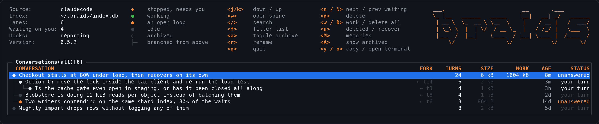
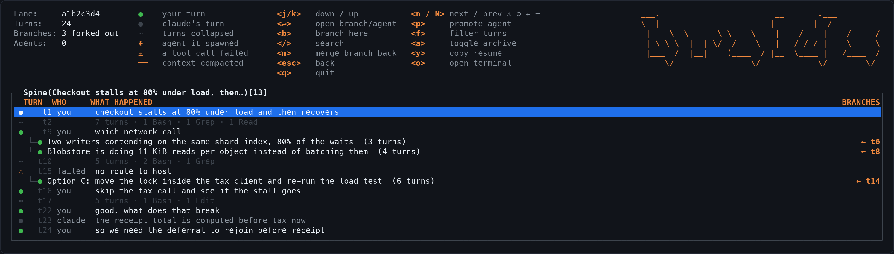
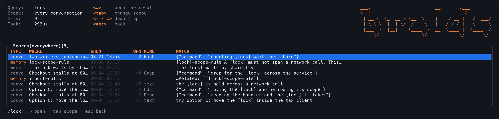
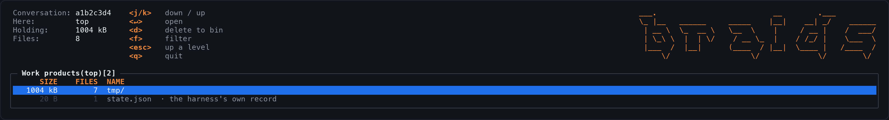
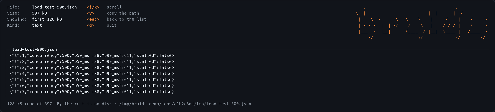
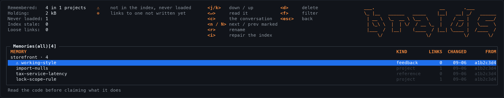
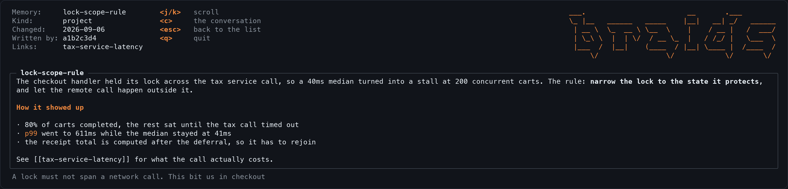
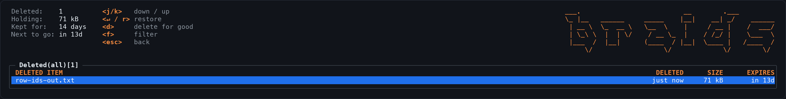

# braids: design notes

> `github.com/Ashes47/braids`
>
> A terminal tool that manages Claude Code conversations as a graph: see every
> session and branch, search all of it at once, and cut a new linear
> conversation from any message in any of them.

This document is the reasoning, not the manual. Every claim in it was measured
on one machine against a real corpus, and where a decision looks arbitrary the
measurement that forced it is written next to it. If you want to know how to use
braids, read [the docs](https://braids.chat/docs/). If you want to know why it
is shaped like this, read on.

The screenshots are real output, captured by `make frames` against a fake
`~/.claude`. They cannot drift from the program, which the hand-drawn mockups
this document used to carry all did.

---

## 1. What it is

Claude Code works best on one linear thread doing one thing. People do not work
that way. A task forks, doubles back, and spawns three side quests, and the only
way to cope today is to run N terminals and hold the map in your head.

braids is that map. One window alongside the others. It draws every conversation
and every branch as one graph, searches all of them in a few milliseconds, and
turns any message into the start of a new conversation.

It never talks to a model. It arranges the conversations you have with one.

---

## 2. Principles

1. **Files are the truth.** braids derives everything from `~/.claude`. Delete
   braids and you lose a view, never a conversation.
2. **One writer per file, always.** Every branch is its own session file. braids
   never appends to a session someone else is using.
3. **The graph is for people; each path is linear for the model.** Root to leaf
   is always a clean single-purpose context.
4. **Search is the front door and the graph is the confirmation.** Nobody finds
   a fork point by scrolling 3,400 turns.
5. **braids is a window you glance at, not a place you live.** Close it and six
   sessions carry on untouched.

---

## 3. What was measured

The corpus is one developer's real history on macOS with Claude Code 2.1.252:
28 to 33 conversations depending on when a number was taken, about 62,000
messages, about 360 MB of transcripts, and 3.3 GB of scratch files beside them.
Numbers taken months apart do not agree to the digit, because the corpus was
being worked in the whole time. Each row says what it was taken from.

### The file format allows all of this

| Fact | Evidence |
|---|---|
| Transcripts are already DAGs | `uuid` plus `parentUuid`: 228 branch points and a fan-out of 7 in one real session |
| Context is the parent chain of the **last** record | Appending a node parented mid-file changed the model's history to `ALPHA, DELTA` |
| `leafUuid` does not control resume | Repointing it replayed the whole linear history |
| Forking from any node is one file write | A synthesized root-to-node path resumed as `ALPHA, BETA` |
| Forking mid-tool-call is safe | The harness drops the dangling `tool_use` and injects "Continue from where you left off" |
| Concurrent writers do not corrupt | Two parallel resumes produced a clean branch point |
| They do race, though | A third resume inherited `ROOT, RIGHT` and `LEFT` was silently orphaned |
| Merging by splice works | A re-parented sibling branch resumed as `ROOT, LEFT, RIGHT` in one context |
| Native forks preserve uuids | `--fork-session` shared 11 of 11 records, so topology is free |
| They record no direction | A fork rewrites `sessionId` throughout and copies the timestamps, so nothing in the file says which came first |
| File birth time does say | A demo tree at 23:21:00, :20, :39, :49 came out in the right order. APFS reports it; Linux may not |
| Fork files are standalone | A child holds a full copy of the prefix, so deletion never cascades |
| Stale reads are guarded | An edit after an external change is refused: "has been modified on disk since I read it" |
| Worktree branches work end to end | `--worktree` put a resumed branch on its own git branch under `.claude/worktrees/<name>`, and two of them edited the same file without touching each other or the main tree |

### Reading it is harder than it looks

| Fact | Evidence |
|---|---|
| `parentUuid` names bookkeeping, not turns | A message's parent is usually an `attachment`. Resolving through them is what makes a chain reconstruct at all |
| A tool result wears the user role | Treating every user record as a landmark left a long spine 85% uncollapsed. Requiring text cut 20,506 segments to 3,015 |
| In-file branching is the common case | One 25,571-turn lane holds **220 junctions and 228 departing branches**, none of them visible in Claude Code |
| Compaction breaks the chain | 35 compactions across this history, each announced one record before the summary that replaces what it dropped |
| Subagents are a separate tree | `<sid>/subagents/agent-<id>.jsonl`, own root, joined by `toolUseId`. One lane hides ten of them, 409 turns in total |
| Subagents can be promoted | Clearing `isSidechain` and rewriting `sessionId` resumed one as a top-level session |
| Identical prefixes make forks ambiguous | A lane cut from a fork shares its turns with the fork *and* its parent. Only a record of what braids did can tell them apart |
| A conversation's state is in its last turn | Assistant text means a reply is owed; an assistant tool call with no result means one is outstanding |
| Files cannot see a permission prompt | A running tool and one waiting for approval are the same record. Only a hook separates them |

### The costs that shaped the code

| Fact | Evidence |
|---|---|
| Incremental sync is worth having | 9.2 s to rebuild everything against **47 ms** when one transcript moved |
| Stored mtimes are second-precision | Comparing a raw `ModTime` marks every lane changed forever, turning an incremental sync silently into a full one |
| Tailing beats re-reading | The largest transcript here took **3,306 ms** to parse from byte zero and **43 ms** to read from the last offset |
| Search is cheap | 1 to 6 ms across about 62,000 indexed units. The index costs about 125 MB against 380 MB of transcripts, because searching text means keeping a copy of it: two thirds of the file is that copy and the search structure over it |
| A rebuild leaves free pages behind | 77 MB of a 201 MB file, against 124 MB for the same data freshly written, so Rebuild reclaims them |
| Work products dwarf conversations | 3.3 GB of scratch against 360 MB of transcript, most of it held by two conversations out of thirty-three |
| Job directories use the short ID | `~/.claude/jobs/9419fd9c`, not the full session UUID the transcript is filed under |
| Most work products are not text | 3,757 of 12,819 are binary, and the largest is 242 MB |
| Vendored directories drown a name index | Skipping them indexes 8,823 names out of 12,957 files, because a `node_modules` holds a thousand files called `index.js` |
| Memories go stale invisibly | 62 of 76 record the session that wrote them, and the first check found one memory out of 83 missing from the index that loads it |
| Failed tool calls are worth finding | 790 of them across this history, 301 in one conversation |
| Terminal identity is not portable | Warp exposes no session id, so window titles come from `--name` rather than a focus API |

---

## 4. Architecture

```
   ~/.claude/projects/**/*.jsonl ─────────────┐
   ~/.claude/projects/*/*/subagents/*.jsonl ──┤
   ~/.claude/projects/*/memory/*.md ──────────┤
   ~/.claude/jobs/<short id>/** ──────────────┤
                                              ├──▶ watcher (fsnotify)
   ~/.braids/hooks.log ───────────────────────┘      tail by byte offset
        ▲                                                  │
        │ braids hook, run by the harness                   ▼
   Claude Code                                    index (SQLite + FTS5)
                                                           │
                                                           ▼
                                                      the screens
                                                           │
                                            spawn ──▶ claude --resume …
```

Everything flows one way: files in, index, screens. Nothing goes back out to a
socket, and there is no HTTP client and no listener anywhere in the binary. An
earlier draft of this document described the hook as posting to localhost, which
was the plan for about a day before a log file turned out to be better in every
way, and the diagram outlived the idea by rather longer.

**Watcher.** fsnotify over the transcript root, each project directory and each
memory directory, adding new projects as they appear. A single turn appends many
lines, so a burst is coalesced into one signal after 400 ms of quiet. The map
only needs to know that *something* moved, because catching up is cheap.
Watching is a convenience and never a requirement: if it cannot start, the map
opens as a snapshot and says so by leaving out `· live`.

`~/.claude/jobs` is deliberately not watched. It holds thousands of files that a
running session writes constantly, weighing them again costs 39 ms, and the only
thing that would change is a column nobody is watching while it happens. It is
re-measured by whatever changed it instead.

**Index.** One SQLite file, stamped with a schema version, dropped and recreated
on a mismatch. `Sync` re-reads only lanes whose size or mtime moved, and only
the part that is new, and drops lanes whose file is gone. Listing lanes costs a
directory scan; titles mean reading a transcript, so they are read only for
lanes being re-read anyway. FTS5 covers `text | thinking | tool_use |
tool_result` for turns and a separate table for memories and work-product names.
A `messages` table carries the parent chain that the graph and the spine are
derived from. It is rebuildable from scratch at any time.

Only `braids index` may create it. A read command pointed at a database that is
not there says so, because quietly creating an empty one answers a mistyped
`--db` with "no matches", which is a wrong answer wearing the shape of a right
one, and leaves a database behind where the typo pointed.

The same rule holds for an index written by a different version, and it took a
release to learn it. Opening one used to drop the tables and carry on, so the
first search after an upgrade emptied the index and then answered from the one
table the drop did not cover, reporting hits from a history it had just
deleted. Opening now refuses and leaves every row where it is. Two callers may
repair it, because both read every transcript again before showing anybody
anything: `braids index`, whose job it is, and the map, which re-reads before it
draws and says so while it does.

The index holds the full text of every message it has read, so `~/.braids` is
`0700` and the file is `0600`, tightened on every open rather than only at
creation. An earlier version left it world readable.

Those are POSIX modes and Windows has none: Go reports every file there as
0666, or 0444 when read only, and a chmod toggles that one flag. On Windows the
privacy comes from the profile directory instead, which braids neither sets nor
asserts. The tests that read modes skip rather than pass, because a test that
passes where the guarantee does not hold is worse than no test.

**Sidecar.** Names, archive flags, branch kinds, and the provenance of branches
braids made itself. Topology is still derived; the sidecar only overrides it
where inference cannot win, because two lanes can hold byte-identical prefixes
and a third cut from either is indistinguishable by content. Losing the sidecar
costs accuracy on those ties, never data.

Provenance could have been a record inside the new transcript. A sidecar keeps
someone else's format untouched, which is worth more.

**Hooks.** `braids hooks --install` adds braids' own entries to
`~/.claude/settings.json`, merging with whatever is already there. The hook
appends to a log rather than talking to a socket, so it works whether or not
braids is running: events that arrive while it is closed are still there when it
opens.

**Launcher.** `claude --resume <id> --name <title>`, plus `--worktree <name>`
for a workspace branch, spawned into a new window of the user's terminal.

### 4.1 Layering, and what a web frontend would still cost

Two layers and an adapter. The boundary is enforced by imports and it holds:
nothing under `internal/core` mentions lipgloss or an escape sequence, and
nothing in core imports `internal/tui`.

```
   frontend      internal/tui              bubbletea + lipgloss
                      │
                      │   tui.Options: 37 fields, 27 of them functions.
                      │   The whole surface a screen is allowed to reach.
                      ▼
   core          store · index · graph · memory · artifacts · hooks · trash · watch
                      │
                      │   store.Source, plus optional capability interfaces
                      ▼
   adapter       store/claudecode          the only package that knows a harness
```

What this buys today:

- **Core never formats for a terminal.** No ANSI, no width arithmetic, no
  lipgloss below `internal/tui`. Core returns data and the screens decide how it
  looks.
- **A harness plugs in at `store.Source`** and says what more it can do by
  implementing `Enricher`, `Sidechains`, `Brancher`, `Promoter`, `Merger`,
  `Tailer`, `Measurer` or `Rememberer`. braids hides a capability a source lacks
  rather than offering a key that fails.
- **A screen cannot reach past its options.** Every mutation the TUI can perform
  is a function it was handed, so `cmd` decides what is possible and a key
  handler cannot quietly grow a dependency on the index.

What a web frontend would still cost, stated plainly because the first draft of
this document claimed it was free:

- **A service layer that does not exist.** `tui.Options` is a boundary, not a
  transport: it hands over Go closures. Sharing it with a browser means naming
  those operations as requests and replies, which is real work.
- **Events that do not exist either.** Liveness today is one channel saying
  *something moved*, followed by a re-read. That is deliberate, because it is
  cheap and it cannot get out of step with the files. A browser needs to be told
  *what* moved, which means modelling events the TUI gets away with not having.

Neither is hard. Both are work, and pretending otherwise is how a plan becomes a
lie about the code. The version of this section written before any of it existed
described an `internal/api`, an `internal/web`, named command types and a typed
event bus: three were empty packages and one was never written at all. They are
deleted, and this is what stands in their place.

---

## 5. Data model

```
project
└── conversation            one .jsonl is one lane
    ├── turn                a user and assistant pair, the atom of the spine
    ├── run                 a collapsed sequence of uninteresting turns
    ├── junction            a turn with more than one child, or a shared-uuid fork
    └── subagent            a separate tree, attached at its tool_use turn
```

**Edges**

- `parent` is `parentUuid` within a file, **resolved through bookkeeping
  records**. Claude Code threads attachments and snapshots into the same chain,
  so a turn's raw parent is usually not a turn. A Source must report the nearest
  conversational ancestor or nothing downstream reconstructs.
- `fork` is derived: two conversations sharing a uuid, with the fork point at the
  last shared record. Direction comes from file birth time, because a fork copies
  the parent's records verbatim, timestamps included, and people routinely fork
  and then carry on in the original, so "diverged first" proves nothing. Where
  no birth time exists the weaker evidence is used in order: containment, then
  length, then last touched.
- `spawn` is `meta.json`'s `toolUseId` pointing at the parent's `tool_use` block.
- `issued` is `sourceToolAssistantUUID`, from a tool result to the assistant turn.

**States**: `working · thinking · your turn · stopped · unanswered · archived`.

### 5.1 Compaction breaks the chain, and `logicalParentUuid` repairs it

`/compact` writes a `system` record with `subtype: compact_boundary` and
**`parentUuid: null`**, which is a new root, followed by a `user` record with
`isCompactSummary: true` carrying the summary text.

One session here has 5 chainless roots, of which 4 are compact boundaries, and
each carries a `logicalParentUuid` pointing at a record still present in the same
file. There are 35 compactions across this history.

> Walk `parentUuid ?? logicalParentUuid`. Naive parent-chain walking splits one
> conversation into one lane per compaction, which is 35 phantom roots.

`compactMetadata` is a gift: `trigger`, `preTokens`, `postTokens`,
`cumulativeDroppedTokens`, `durationMs`, and the exact `preservedMessages.uuids`
carried across. One real boundary went from **1,000,241 tokens to 15,033,
dropping 985,208, over 2m21s**. All of it is drawn, because it is the most
consequential thing that happens to a conversation and today it is invisible.

**The dropped context is still in the file.** Compaction changes what is *sent*,
not what is *stored*. Branching from before a boundary therefore recovers context
the running session has permanently lost, which makes a compact boundary the most
valuable junction in the graph.

---

## 6. Screens

### 6.1 The map



One row per conversation. Vertical is sequence, indent is fork depth, and
`← t14` is the exact turn a branch left its parent. Age is right-aligned because
staleness is what people scan for. Archived rows collapse out of the way.

A branch appears here and in its parent's spine, because the two answer
different questions: the map says what exists, the spine says where this thread
split.

### 6.2 The spine



A long conversation is mostly turns nobody will read again, so the spine keeps
the landmarks and collapses the rest into a run that counts what it swallowed. A
25,571-turn lane becomes about 3,000 rows, and reloading it is a query against
the index rather than a parse of the file.

**Landmarks are human turns that said something.** A tool result is recorded with
the user role but is the harness returning output. Counting those as landmarks
left that lane at 20,506 segments; requiring text brought it to 3,015. A junction
is always a landmark however dull the turn.

The active path is the parent chain walked back from the **last** record, which
is how the harness reconstructs context, so the spine shows the conversation the
model would see rather than the file in order.

Two kinds of split share one vocabulary: a branch kept inside the transcript,
from a rewind, and one given its own file, from a fork. They are the same event.

**A compaction is drawn as a seam** naming what it let go, placed before the turn
the conversation resumed at rather than after the last one it kept, because a
collapsed run can swallow the turn a seam nominally follows and the hole belongs
where the thread picks up. `b` on a seam branches from the turn above it, which
is the point of drawing them.

**A failed tool call is a landmark**, on its own line, carrying what came back.
Where something went wrong is the question a long conversation is most often
reopened to answer, and a failure buried in a collapsed run cannot be found at
all. A run that swallows failures says so: `8 turns · 2 failed`.

`n` and `N` step between marks: a branch inside the transcript, a branch that
left for its own file, an agent it spawned, a failure. The hint names them with
their own glyphs rather than in prose, because any word general enough to cover
four different things says nothing.

`j` and `k` wrap, so off the top is the bottom. Half-page jumps do not, since
landing at the far end of a long conversation loses the reader.

### 6.3 Search



Full text over every message, thought and tool call, plus every memory and the
name of every work product. It runs on every keystroke because it can.

**`↵` opens the screen that can act on the hit**: a turn in its spine with the
cursor on it, a memory in the reader, a work product in the browser at its
directory. Landing inside the thread is the point, since a result on its own
says nothing about what came before it. When the turn was swallowed by a
collapsed run, it lands on the run.

**`tab` changes scope.** Opened from a conversation, search starts inside it and
`tab` widens to everything and back.

Three decisions the data forced:

- **A separate table, not a column.** A memory and a work product have no
  message, no role and no position in a conversation. Crowding them into the
  table of turns would make every column optional.
- **Names, not contents, for work products.** One of them is 231 MB. Reading
  them to index their text would cost more than everything else braids does put
  together. Vendored directories are skipped, because a `node_modules` holds a
  thousand files called `index.js` and indexing them buries the one dump you
  were looking for.
- **Each kind is ranked on its own and then merged** by taking one of each in
  turn. bm25 rewards a match in a short document, and a filename is three words
  against a turn's several hundred: ranked together, filenames bury every
  conversation, which is the opposite of what a search across everything is for.
  One shared query has the same flaw a level down, where a thousand filenames
  starve the memories before the merge sees them. That one was visible as zero
  memory hits for a word appearing in four of them.

**Memories are kept live and work-product names are not.** A memory is what you
write and then immediately want to find, so it is re-indexed on every refresh,
behind a check costing one directory listing per project. Work-product names wait
for `braids index`, because deciding whether they moved means walking a tree of
thousands of files.

`/` searches everything and `f` narrows the list in front of you. They are
different jobs and they get different keys.

### 6.4 State, and the one thing files cannot say

A conversation's state is readable from its last turn, so the map names it rather
than guessing from file times:

| State | Meaning |
|---|---|
| `working` | a tool call is outstanding and the file is still moving |
| `thinking` | the last turn is yours and a reply is in flight |
| `your turn` | the assistant answered and nobody has replied |
| `stopped` | a tool call is outstanding but nothing has moved since, so it was interrupted mid-call |
| `unanswered` | a prompt nobody ever answered, which is what cutting a branch at a question leaves |

`n` and `N` step between the conversations owed something by a person, and the
facts block counts them.

**What files cannot say** is whether an outstanding tool call is *running* or
*waiting for permission*. Both are an assistant turn with no result yet. A hook
can, and `braids hooks --install` asks the harness to report it. A session that
says it is waiting outranks anything inferred, until the transcript moves more
than 30 seconds past the report, after which the file is the better witness
again.

**Installing edits a file the user depends on**, which is the only thing braids
does that is not purely additive. So it merges rather than writes: every hook
already there is kept, braids' own entry is added beside it, `--remove` takes
back only what was added, and a settings file that cannot be parsed is refused
rather than replaced by a guess. On this machine that meant adding to eight
events already carrying another tool's hooks without disturbing any of them.

**A hook belongs to braids because it *is* braids**, not because it matches the
path braids happens to occupy today. Matching the exact path means a second build
in another directory reads the file as empty, installs a duplicate, and leaves an
entry pointing at a binary that may be gone, failing on every event six times a
session. So an entry is recognised by its program name and subcommand. Entries
are edited one at a time, never by dropping the group they sit in, so a hook a
user placed beside braids' own survives.

**Hooks are opt-in and stay that way.** Installing braids does not install them.
A binary that edits the user's settings as a side effect of being installed is a
binary that cannot be trusted. Everything else works without them; only the one
distinction files cannot make is missing, and the map says which of the two it is
looking at, because a capability that is absent should be visible rather than
silently degraded.

### 6.5 Work products, as a size browser rather than a file list



A session's scratch outweighs its transcript by an order of magnitude: 3.3 GB
against 360 MB here, and nine files account for 1.3 GB of it. Deleting the lot
was the only option braids first offered, which is the wrong shape for a
conversation whose transcript you want and whose 231 MB JSON dump you do not.

So `w` opens the shape `du` and `ncdu` settled on: one level at a time, heaviest
first, directories weighed by everything beneath them. Twelve thousand files at
thirteen levels deep listed flat would be accurate and useless. The question is
always which single branch is holding the room, and two keystrokes answer it.

`state.json` and `timeline.jsonl` are shown and refused. They are the harness's
own record of a job, and removing either would corrupt its view of a job that may
still be running.

Deleting goes to the bin like everything else, and says so plainly, because
someone reclaiming a disk is watching a disk rather than a list and a bin that
silently keeps the bytes would make braids a liar.

**Work products change without the transcript changing**, which the index could
not see: `Sync` re-reads a conversation only when its transcript moved, so a
deleted scratch file left the work column reporting the old size until something
unrelated happened to that conversation. Measuring means walking directories, so
it is done by whatever changed them rather than on every refresh.



`↵` on a file shows it, with two limits the data forces:

- **Only the head is read**, 128 kB, because the largest work product here is
  242 MB and a viewer that reads the file is a viewer that stalls the program.
  The frame says how much it holds and that the rest is on disk, with the amount
  before the path, since a path deep in a job directory would push it off the
  end of the line.
- **Data is named rather than drawn.** 3,757 of 12,819 work products here are
  binary, and a database rendered as characters is a thousand screens of noise.
  Detection is a NUL byte in the sample, which no text format contains and every
  binary one here does, backed by a printable-character ratio for the rest.

Lines are broken, never reflowed: a line of JSON means what its columns say, and
rewrapping it on word boundaries would rearrange the meaning. `y` copies the
path, because what you do with a file braids will not show you is open it in
something that will.

Nothing is probed to decorate the listing. Deciding whether each of eight
thousand files is readable would mean opening all of them, so braids opens the
one that was asked for and reports what it found.

Work products whose conversation is gone are found by `braids work --orphans` and
reclaimed with `--reclaim`. Nothing will ever look at them again, and nothing
else would ever clear them up.

---

### 6.6 Memories



A harness keeps memories as small markdown files beside the transcripts, with an
index, `MEMORY.md`, that is what a session actually loads. Two consequences
follow, and they are why this screen exists: a memory can be present and do
nothing, by being absent from the index, and an index row can point at a file
that is gone. Neither is visible from inside a session.

Most memories also record the session that wrote them, 62 of 76 here, and 61 of
those conversations are already indexed. That is a real edge, so `c` lands on the
conversation where the decision was made, and the spine is already there to find
the turn.

Three findings are reported apart because they mean different things. A memory
the index omits is broken. An index row with no file is a stale pointer. A link
to a name that does not exist yet is a legitimate note to self, and braids says
so rather than calling it a fault.

That distinction has to survive into the wording or it does not exist. Calling a
loose link "points at a memory that is missing" invites someone to press the
repair key, get told the index is already right, and reasonably conclude braids
is broken: the mark says fix me, the message says nothing to fix, and both are
true of different things. So the legend says "links to one not written yet", and
repairing an index that needs nothing says which link the row is waiting on and
that it is a note. There is no key to fix one, because the only ways are to
delete somebody's note, invent the memory it points at, or guess which existing
memory was meant.



`↵` reads the memory itself. The list says what braids knows *about* one, and
that is not what you came to check. The body is rendered as markdown, wrapped to
the frame, without the frontmatter, because the frontmatter is already the facts
above it.

The markdown subset is deliberately small: emphasis, code spans, headings, list
bullets and fenced blocks, because that is what these files use. Three rules it
needs to be usable on real notes:

- **A paragraph is joined before it is styled.** Markdown reflows a paragraph, so
  emphasis may open on one line and close on the next, and real notes wrap at 78
  columns. Rendered line by line, `**narrow the / lock**` is two unmatched marks
  and the reader shows the asterisks.
- **`2 * 3` is arithmetic.** An emphasis mark followed by a space does not open a
  span.
- **`snake_case_names` keep their underscores.** An underscore between word
  characters is part of the word.

Styling happens before wrapping, and wrapping is done here rather than by a
general text wrapper, because a wrapper that knows nothing about styles leaves
them open across a line break: the bold spills into the frame border and every
line after it.

### 6.7 Curating memories

Everything that changes a memory changes the index in the same breath. The index
is what a session loads, so a memory deleted without its row leaves a pointer to
nothing, and one renamed without its row becomes invisible while still sitting on
disk. Both are failures you cannot see from inside a session, and both are what
braids found in a real set the first time it looked, so they are the normal
outcome of editing these files by hand rather than a hypothetical.

**Delete** (`d`) sends the file to the bin, like every other deletion, and drops
its row. The index is written first: a row pointing at a missing file is a worse
state than a file with no row, because the row is the part that gets read.

**Repair** (`i`) makes a project's index agree with its files. It is the highest
value per keystroke, because it fixes the invisible failure and needs no
judgement about content. Rows that were already right are written back byte for
byte, including any shape this code does not model.

**Rename** (`r`) follows the name everywhere it was used: the file, the index
row, the frontmatter's own `name`, and every `[[link]]` pointing at it, and says
how many links it rewrote. That last part is why it is one operation rather than
three. A rename that leaves fourteen memories pointing at a name that no longer
exists has traded one tidy name for fourteen broken references.

**Retype was considered and dropped.** The type is a label braids groups and
filters by; nothing loads or skips a memory because of it. A wrong label costs a
wrong grouping and nothing else.

**The guard.** braids editing a file a live session may also be writing breaks
one writer per file, and what is at stake is something a person asked to be
remembered. So an edit is refused while anything in that project is running,
naming the conversation holding it up. That is stricter than it needs to be and
cheaper than being wrong.

The index is replaced atomically at `0600`, because a half-written index is a
session that loads half a memory set. Everything else **keeps the mode it
found**: an earlier version tightened memory files from `0644` to `0600` as a
side effect of rewriting them, which is not braids' decision to make.

### 6.8 Reading a transcript as it is written

Transcripts are append-only, and braids at first ignored that: a changed
conversation was deleted from the index and re-read from byte zero. On the
largest here that is **3.3 seconds of parsing for every turn**, and it ran on the
interface thread, so the frame froze for each one. Chatting in a big conversation
made the map unusable.

Each lane now records the byte after the last complete record read, and the last
conversational message seen. A conversation that grew is read from there:
**3,306 ms to 43 ms**, and it no longer scales with the conversation.

Three things this had to get right, each of which failed first:

- **A parent behind the offset.** A message's `parentUuid` usually names a
  bookkeeping record, resolved by walking a map built while scanning, and
  starting mid-file that map is empty. A transcript is linear, so a record
  appended after the boundary has the last conversational message as its
  ancestor. An *empty* parent stays empty, because that is a compaction boundary
  deliberately having none, and giving it one grafts a new root onto the
  conversation it replaced.
- **A compaction straddling the boundary.** A compaction is announced one record
  before the message it belongs to. Announced at the end of one read it attached
  to nothing and was lost, so a read that ends still holding one now stops before
  it and the next read sees the pair together.
- **A record still being written.** A line with no newline yet is left where it
  is rather than half-parsed, so the offset only ever lands on a record boundary.

Appending is refused for every shape that is not growth from a prefix already
read: never indexed, shrunk, rewritten to the same length, an offset past the
end, or a source that cannot be tailed. All of those fall back to the whole file.
Being wrong corrupts a conversation's history; re-reading is merely slow. A test
grows a transcript one turn at a time and compares every row, count, title and
compaction against reading the same file whole.

**The read also moved off the interface thread**, with changes coalesced while
one is in flight, so no conversation of any size can freeze the frame. That made
the sidecars concurrently read while written, which for a Go map is not stale
data but a crash, so they are guarded.

**The open conversation is re-read too**, so its spine grows while you sit on it.
Before that it was a snapshot taken when you pressed `↵`: branches appearing off
it refreshed, the turn count beside it on the map climbed, and the turns
themselves never arrived.

The cursor obeys one rule: **hold your place, unless you were at the end.**
Someone on the last turn of a live session is watching it arrive and should keep
watching; someone reading turn 400 is not, and dragging them to the bottom would
lose the thing they were reading. Rows are found again by identity. A subagent is
exempt, because it is read from its own transcript and reloading by conversation
ID would replace it with the wrong spine entirely.

### 6.9 Branch

The field opens on the turn it will cut, pre-filled from that turn's own words,
and `tab` chooses what kind of branch it is:

- **thought** shares the working directory. Exploring, reading, planning. The
  cheap default, because most branches never write anything.
- **workspace** asks the harness for a git worktree of its own, so two branches
  that both write to the repo cannot collide.

braids does not create the worktree. `--worktree` is the harness's own flag and
its own job; braids records the choice and puts the flag in the resume command.
The kind is chosen fresh each time rather than remembered, because a workspace
writes files and that should be a decision.

**A workspace is refused where one could not exist.** A worktree needs a git
repository, and a conversation run somewhere that is not one cannot have a branch
of that kind. Discovering that when the branch is resumed, after it has been
created and named, is far too late. For the same reason the flag is left out of a
resume command whose directory has stopped being a repository: a flag known to
fail is worse than one absent.

`r` renames a conversation on the map, pre-filled with what it is called now.
Names live in the sidecar, so renaming never touches a transcript, and emptying
the field restores whatever the harness called it.

### 6.10 Subagents

A subagent is a whole conversation the harness collapses into one `tool_use` and
one `tool_result`. One real lane here hides ten of them, 409 turns in total, none
of which Claude Code offers any way to read. They are drawn against the turn that
spawned them, joined by the `toolUseId` in each agent's meta file.

**`↵` reads one in place**, from its own transcript, writing nothing. Deciding
whether an agent is worth keeping should follow reading it rather than precede
it, and promoting first would mean a file on disk for every agent you merely
glanced at. While reading one, the actions that assume a resumable session say so
rather than half-working: a subagent is not a session until it is promoted.

**`p` promotes it**, from the parent's spine or from inside the agent being read.
Clearing the sidechain mark and giving it a session ID is enough for the harness
to resume it, verified end to end by a promoted agent answering a question about
its own earlier work. A promoted agent shares no message IDs with its parent, so
nothing could infer where it came from, and its provenance is recorded, which is
what hangs it under the conversation that spawned it.

### 6.11 Archive, delete, and the bin

`a` archives the selected conversation and `A` reveals what is archived. That is
the gesture for most tidying: instant, reversible, and it leaves the conversation
searchable, so nothing has to be deleted to get a map that reflects what is being
worked on. An archived row keeps its place in the tree when shown, drawn with `○`
rather than `●`, and its status column says `archived` rather than whatever it
was doing when it was put away.

**The title always says what is being held back**, because a map that silently
omits things is one you stop trusting.

`d` deletes, moving everything a conversation owns into the bin and reporting
what was reclaimed. `D` discards a conversation's work products and keeps the
conversation, which is the deletion nobody regrets.



`u` opens the bin. A one-step undo was the wrong shape: it reached one deletion
back, and only for as long as the session lived, which is no help at all for
wanting the eighth of ten conversations back two days later.

Each entry carries its own manifest beside the files it holds, so the bin is
readable by a session that did not do the deleting. Every row says how long is
left before it goes on its own, **turning amber inside the last two days**, so
nothing quietly passes the point of recovery. Retention is 14 days, and expiry
runs when the bin is opened so the deadlines shown are true.

Binned files **keep the directories they came from**. Named by basename alone,
two files called `data.json` collided and one was silently lost. That is data
loss, so there is a test that bins two files of the same name and reads both
back.

Three rules the notices state outright:

- **It never cascades.** A fork carries its own copy of the prefix it shares, so
  deleting a parent cannot break a child. That is the fear that makes people
  hoard, and here it is simply not true.
- **Orphans move up, not out.** A branch whose parent was deleted is redrawn
  under the nearest conversation still there, following what was recorded.
  Inference cannot do this alone: every fork of a fork shares a byte-identical
  prefix with the whole line above it, so the counts tie and the branch lands at
  the shallowest ancestor.
- **A running conversation is refused.** Deleting a session mid-turn is the one
  accident worth preventing outright, and `d` from inside a conversation is
  redirected to the map where you can see what would go.

---

## 7. Keymap

Every binding a screen has is in that screen's own header, which is the only
copy that cannot go stale. This is the same list, for reading away from the
program.

**The map**

| Key | Action | Key | Action |
|---|---|---|---|
| `j` `k` | down, up | `n` `N` | next, previous waiting on you |
| `↵` | open the spine | `d` | delete to the bin |
| `/` | search everything | `w` `D` | work products, discard them all |
| `f` | filter this list | `u` | open the bin |
| `a` `A` | archive, show archived | `M` | memories |
| `r` | rename | `y` `o` | copy resume, open a terminal |
| `q` | quit | | |

**The spine**

| Key | Action | Key | Action |
|---|---|---|---|
| `j` `k` | down, up | `n` `N` | next, previous mark |
| `↵` | open the branch or agent | `p` | promote the agent |
| `b` | branch here | `f` | filter turns |
| `m` | merge a branch back | `a` | archive |
| `/` | search everything | `y` `o` | copy resume, open a terminal |
| `esc` | back to the map | `q` | quit |

**Search**: `↵` open the result · `tab` change scope · `↑` `↓` move · `esc` back

**Work products**: `j` `k` · `↵` open or descend · `d` to the bin · `f` filter ·
`esc` up a level. Reading a file: `j` `k` scroll · `y` copy the path · `esc` back

**Memories**: `j` `k` · `↵` read · `c` the conversation · `n` `N` next marked ·
`r` rename · `i` repair the index · `d` delete · `f` filter · `esc` back

**The bin**: `j` `k` · `↵` or `r` restore · `d` delete for good · `f` filter ·
`esc` back

`esc` goes up a level, echoing Claude Code's own `esc esc` rewind, and it peels
one layer at a time: leave the field, clear the text, then leave the screen.

---

## 8. Core operations

**Branch from a message.** Walk the raw chain from the chosen turn to the root,
bookkeeping records included since the harness wrote them, copy those records
into a new file with a fresh `sessionId`, prepend a title so the branch is named
on the map, and append a record pinning the leaf. The new file is built in a temp
file and renamed into place, so an interrupted branch leaves either a whole lane
or none. **The source is opened read only and never written to**, which a test
asserts by hashing it before and after.

Verified end to end: a branch cut at turn 2 of a real conversation resumed with
exactly that prefix as its context, and appeared on the map as a child at `← t2`.

**Branching a running lane is allowed.** Forking writes a new file, so the
running session is untouched. Any completed turn is permitted; only the in-flight
turn is blocked, because its records are still being written. This is the point:
you watch an agent go wrong, branch from three turns before it did, and try
another way without killing it.

**Promote a subagent.** Set `isSidechain: false`, rewrite `sessionId`, drop
`agentId`, write as a top-level file. The subagent's own transcript is not
touched.

**Merge.** `m` on a branch in the spine joins it back as a **new** conversation
holding the base in full and then the branch's own turns. Neither original is
touched, which a test asserts by hashing both.

It is a splice of real messages, not a summary of them. Carried records are
given fresh IDs, because reusing them would leave a conversation sharing message
IDs with the branch, which is precisely what braids reads as a fork: the merged
lane would draw as a branch of the thing it merged.

**A merge only makes sense when both sides carried on after they parted.** A
branch that left and was never followed already holds the whole conversation it
came from, so joining them would write a copy of the branch under a new name.
braids refuses that and says which one to open instead. The case merge exists
for is the other one: you branched at turn 20 to try something, went back and
kept working in the original, and now want both in one context, which is exactly
what happens when two agents work from the same point at once.

**A merge is never one keystroke.** It is the only action that combines two
histories, so `m` reports what it would carry over and waits. Fourteen turns and
one turn are different decisions.

Verified end to end: a conversation of ROOT, STEM, TRUNK merged with a branch of
LEAFA, LEAFB resumed as `ROOT, STEM, TRUNK, LEAFA, LEAFB`.

**Continue a conversation.** `y` copies `claude --resume <id> --name <title>`
through the terminal's own copy escape, OSC 52, so it works over SSH with no
helper binary. `o` opens a terminal: tmux and iTerm2 are driven directly, and
anywhere else `BRAIDS_SPAWN` names a template understanding `{cmd}`, `{name}`
and `{dir}`. With neither, `o` copies the command rather than guessing at a
setup.

A title and a working directory are data braids read out of a transcript, so
**every value substituted into that template is shell-quoted first**: the
template supplies the shell syntax and the values never do. Unquoted, a
conversation called `x; rm -rf ~ #` is a command rather than a name, and pressing
`o` runs it. That was a real hole, found with a probe and closed. For the same
reason the bin refuses an entry ID that is not one plain directory name, because
`Purge` removes a tree and `filepath.Join` resolves `..` straight out of the bin.
Three separate places had that same shape of bug: the bin, the memory remover,
and a `--path` on the command line. Each is now guarded at the destructive call
rather than at the caller.

braids does not guess at a terminal. Terminals differ in whether they can be
told to run a command at all, and the working directory matters: resuming from
elsewhere files the transcript under a different project, so a lane carries the
`cwd` its conversation ran in.

**Naming a branch** is a stop-word filter over the turn's own words, so
"why is the queue stalling" becomes `queue-stalling`, pre-filled into an
editable field. It is good enough never to block on and not good enough to be
permanent, which is why `r` renames and names live in the sidecar.

A better version was designed and is not built: score the tokens by document
frequency across the corpus, which is free because FTS5 already has it, keep
terms in a band where `2 ≤ df ≤ 4%` of the corpus, prefer tokens containing
`- _ 0-9` because identifiers make better names, take three and slugify.
Validated by hand against 2,298 real messages, it produced names like
`ttl-reconcile-provisioning` and `clone-annotaion-fresh`. It is written down here
rather than in the code because the stop-word filter has not yet annoyed anyone.

**Worktree lifecycle is never automatic.** A conversation can be binned and
restored; uncommitted code cannot. Archiving a workspace lane leaves its worktree
alone, and braids does not remove one.

---

## 9. Visual language

```
●  turn or lane           ⋯  collapsed run          ◆  agent, or needs you
⚠  a failed tool call     ○  archived               ≈≈ context compacted
├─ junction               ← t14  fork point         ⊘  not in the index
```

- Colour carries **status only**, never identity. Identity is position and name.
- **The scale is steep and the top of it is rare.** A session stopped and waiting
  on a person is the only thing drawn loudly, because it is the only thing that
  cannot proceed without them. Anything alive is green, an open loop is the
  accent, and something merely owed a reply is plain text, because there are
  usually a great many of those and a screen where everything is urgent says
  nothing. This was wrong at first: `your turn` was drawn in the accent too, so
  seventeen rows shouted and the one that mattered did not stand out.
- **Shape as well as colour at the top of the scale.** In a long list a different
  glyph carries further than a different hue, and it survives a terminal whose
  palette is not what braids assumed.
- **No filled backgrounds outside the cursor.** A background reads as a box drawn
  around a row, which is heavier than anything else on screen and fights the
  panel it sits in.
- **The cursor follows the conversation, and when it is gone, the row above it.**
  Archiving or deleting the selected row would otherwise throw the reader to the
  top of the list on every act of tidying, which is exactly when losing your
  place costs most.
- **The header and the table are laid out by the same code.** Columns drop from
  the right as the terminal narrows: size, then status, then project, then turns,
  keeping the name and the age. The two width bugs this screen has had were both
  the header and the rows computing their own widths and drifting apart.
- **Every binding a screen has is in its legend.** A key that works but is not
  listed may as well not exist, so the header grows rows and drops the glyph key
  before it drops a key.
- A glyph key sits beside the facts when there is room left after the keys, and
  **each mark in it is drawn in the style it is drawn in on the screen**. Colour
  here is meaning, so a key rendered in one flat colour would teach the wrong
  thing.
- A paired key says what each half does: `n / N  next / prev`, not `n/N  next`.

**The mark is decoration, and priced accordingly.** braids sets its name in the
angular ASCII face k9s uses, flush right in the header. It is the last thing to
get room and the first to lose it: the facts, every key binding and the glyph key
all come first. Two sizes exist so a normal terminal gets one at all, and below
that it goes.

Pricing it correctly took two attempts. The plan reserved `logoGap` for it while
the drawing spent `factsGap` plus slack, so across a five-column band the plan
decided the mark fitted and then drew no mark at all: 215 columns had the logo,
220 did not, 230 did again. Three tests already covered the mark and all of them
passed through that band, because they asserted on the plan, where the mark was
set the whole time. The test that catches it asserts on the drawn header.

It is also genuinely expensive. The map needs 108 columns for its facts, its
glyph key and all fourteen bindings, and 195 for those and the mark: 87 columns
of decoration. `Options.HideMark` exists for a caller drawing a frame to be
looked at somewhere the logo already is, which is how every screenshot in this
document is 138 columns rather than 195.

**Glyph width is a correctness issue.** `● ◆ ○ ← ⚠ ⊕` are East-Asian *Ambiguous*
width, and some terminals and fonts render them double wide, which silently
breaks every box. Widths are measured with a rune-width table rather than
`len()`, and `--ascii` swaps in narrow glyphs for terminals that get it wrong.
The frame is swept across widths 1 to 300 and heights 1 to 40 in tests, because
the arithmetic subtracts borders and margins and below a floor those
subtractions go negative and panic.

### 9.1 Other harnesses

v1 is Claude Code only. The primitive generalises to any agent that writes local
transcripts and can resume one by id, so `store.Source` is a port from day one,
but no second adapter ships until someone asks for it.

Verified on this machine:

| Harness | Storage | Shape | Fit |
|---|---|---|---|
| Claude Code | `~/.claude/projects/**/*.jsonl` | a DAG, uuid and parentUuid | native |
| Codex | `~/.codex/sessions/YYYY/MM/DD/rollout-*.jsonl`, 493 MB here | a flat log, no parent pointers | works, file-level branches only |
| opencode | SQLite since v1.2, was per-file JSON | messages and parts | an adapter reads SQLite |
| Aider | `.aider.chat.history.md` | markdown, linear, no resume by id | poor fit |

Two consequences for the domain model:

- **Branch points must not be assumed to live inside a transcript.** They do in
  Claude Code; in Codex a fork is only ever a separate file.
- **Prefix fingerprinting is the universal fork-detection method**: hash the
  opening run of turns and match across lanes. Shared-uuid matching is the exact
  fast path where a harness offers it, not the general algorithm.

Claude Code's luxuries, the subagent forest, `compactMetadata` and hook-driven
state, are declared as optional capabilities and never assumed.

---

## 10. The command line

braids should be usable by the thing it is watching. Every command that reports
something takes `--json`, so an agent can search its own past conversations,
find where a decision was made and branch from that exact turn.

Two properties make that work and neither is incidental. **IDs are whole in
JSON**: the tables shorten them with an ellipsis to fit a terminal, and a caller
that cannot hand an ID back has been given nothing. **An empty result is `[]`**
rather than a sentence, so nothing has to tell "no matches" from a parse failure.
The JSON types are declared separately from the ones braids works with
internally, because what it prints for a program is a promise and what it holds
in memory is not.

The same ellipsis is accepted on the way back in. Copying a shortened ID off the
screen and pasting it is the obvious thing to do with one, and refusing an ID
braids itself printed teaches nobody anything.

**Getting it wrong should cost one line, not a trip to the manual.** A mistyped
command names the one that was meant, measured by edit distance and offered only
within two edits, because beyond that it is a different word. A flag mistake
answers with the flags that command actually takes, drawn from the flag set
itself so it cannot drift. A flag where a command should be is the map, because
`braids --print` is documented that way and reading it as a command name answers
a documented invocation with "unknown command". Errors exit 1 and go to stderr.

`braids hook` is the one command meant for the harness rather than a person. It
reads a payload on stdin, so typed by hand it used to wait on a terminal that
would never send it one, indistinguishable from a hang. It now checks whether
stdin is a terminal, by ioctl rather than file mode so a redirect from
`/dev/null` still reads as the harness, and says who runs it. Piped, it stays
silent whatever it is given, because a hook that fails loudly breaks the session
it is reporting on.

`braids help` and `braids version` carry the mark, the full face and the small
one respectively, coloured only when stdout is a terminal, because escape codes
in a pipe are noise in somebody's grep. The installer opens with the same mark.

### 10.1 Telling you a build is old without asking anyone

braids cannot say that a newer version exists. Finding out means asking, and
braids makes no network calls. It can say how long it has been since anyone
looked, from two facts it holds locally: when this binary arrived, which is its
own mtime, and when the installer last ran, which is a stamp the installer
leaves in `~/.braids`.

The stamp is the whole design. Without it the only thing that could clear a
notice is an actual update, so a build that is current and old would be nagged
about forever, which is precisely the case where there is nothing to do. The
installer writes it on every run **including the run where it decides there is
nothing to install**, so checking and finding yourself current resets the clock.

The two ages are kept apart. The build's age is what the header reports, and
`max(build, check)` is what decides whether to say anything, because a check
does not make a binary younger and reporting it as though it had would be a lie
told by arithmetic.

The interval is 30 days. braids is a local reader with no server to stay
compatible with and an index that rebuilds itself, so being a release behind
costs nothing and a fortnightly reminder is a nag.

The offer rides in the version row rather than the key legend, because a
fifteenth binding needs a third column of hints and that column costs the glyph
key, which names marks that are on the screen right now. `v` runs the
installer through the terminal, printing the command before it does, with
`BRAIDS_BIN_DIR` pointing at the directory the running binary is in so it
replaces braids where it lives rather than leaving a second copy for `PATH` to
arbitrate. Replacing a running binary is safe on Unix: the open file keeps its
inode and the new version takes over at the next launch.

It is not `u`. That opens the bin, and recovering deleted files and replacing
your binary over the network should not be one shift-slip apart.

There is no timer and no background check. A tool whose headline is that it
makes no network calls should not make one while you are not looking, and an
update that arrives unannounced can also mean an unexplained re-index, because
a schema bump drops and recreates the index rather than migrating it.

---

## 11. What is built, and what is not

Built: the index and `braids search`; the map with fork detection and state; the
spine with runs, junctions, compaction seams, failed calls and subagents; branch,
with thought and workspace kinds and recorded provenance; live refresh by
tailing, off the interface thread; the search screen across conversations,
memories and work-product names; optional hooks and the waiting queue; the work
product browser with peeking and orphan reclamation; the memory screen with
delete, repair and rename; archive, delete and a bin you can browse and recover
from; merge; promote; `--json` on every reporting command; and the site and docs
at [braids.chat](https://braids.chat).

Not built, in the order they are likely to matter:

- **Multi-select and a filtered sweep.** Tidying thirty conversations one key at
  a time is the obvious next thing.
- **Document-frequency naming.** Designed above, not written.
- **A second harness adapter.** The port exists and nobody has asked.
- **A web frontend.** Deferred rather than dismissed, and §4.1 says honestly
  what it would cost. The open question is whether it mirrors the TUI or takes a
  different shape entirely for people who find a terminal hard.

How the screenshots and the site are built is in
[CONTRIBUTING.md](CONTRIBUTING.md).

---

## 12. Non-goals

- **Not a chat client.** braids never sends a message to a model.
- **No server, no account, no sync.** Everything is local, and there is no HTTP
  client and no listener in the binary. The installer reaches the network,
  which is its job, and the map's update key runs the installer.
- **No background checks of any kind.** No telemetry, no update ping, no timer.
  braids reaches the network only when a person presses the key that says it
  will.
- **No auto-segmentation of existing conversations.** The user decides where a
  branch belongs; the tool only makes it one keystroke.
- **No re-stamping of stale environment on fork.** A branch replays the world as
  it was, and the harness already refuses edits based on stale reads.
- **No summary-based merge.** Merging splices real turns or it does not happen.
